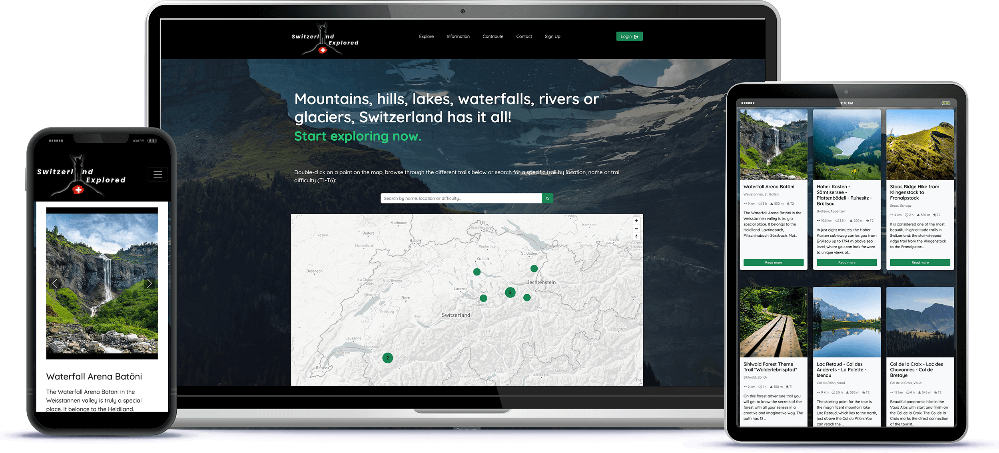

# SwitzerlandExplored: Discover and share hiking trails in Switzerland



**SwitzerlandExplored** is a web application where hiking enthusiasts can discover, share, and review hiking trails. Users can create accounts to add their own hikes, explore trails on an interactive map, search by location, difficulty, and more.

## Features

- **Interactive Map**: Explore hiking trails visually on an interactive map
- **Add Hikes**: Users can contribute their favorite hikes with details like location, difficulty, description, images and more
- **Search Functionality**: Search for hikes by location, name, or difficulty level
- **User Reviews**: Logged-in users can leave reviews and ratings for different hikes
- **Bookmark Hikes**: Save your favorite hikes for easy access later
- **Responsive Design**: Enjoy a seamless experience across all devices

## Technologies Used

- Javascript
- Node.js
- Express.js
- EJS
- MongoDB

## Installation

To get a local copy of the project up and running, follow these steps:

1. clone the repository
2. install the dependencies: `npm install`
3. Create a .env file in the root directory and add the following variables:

```
CLOUDINARY_CLOUD_NAME=your_cloudinary_name
CLOUDINARY_KEY=your_cloudinary_key
CLOUDINARY_SECRET=your_cloudinary_secret
MAPBOX_TOKEN=your_mapbox_token
DB_URL=your_mongodb_connection_string
EMAIL_USER=your_email
EMAIL_PW=your_email_password
EMAIL_HOST=your_email_host
SECRET=your_secret
CLOUDFLARE_SITE_KEY=your_site_key
CLOUDFLARE_SECRET_KEY=your_secret_key
```

I used Cloudinary for image storage and Mapbox for the maps.

4. Start the server: `npm start`
5. Open your browser and navigate to: <http://localhost:3000> (or any other port number you prefer to use)

## Contributing

If you find bugs or have suggestions for improvements, please submit an issue using the issues tab above. If you would like to submit a PR with a fix, reference the issue you created.

## Known Issues (work in progress)

This was my first CRUD project, and the main functions work fine, but the project hasn’t been tested thoroughly for all edge cases and potential errors yet.

## Contact

For questions or feedback, please contact:

- Email: <info@natgian.com>
- GitHub: [natgian](https://github.com/natgian)
